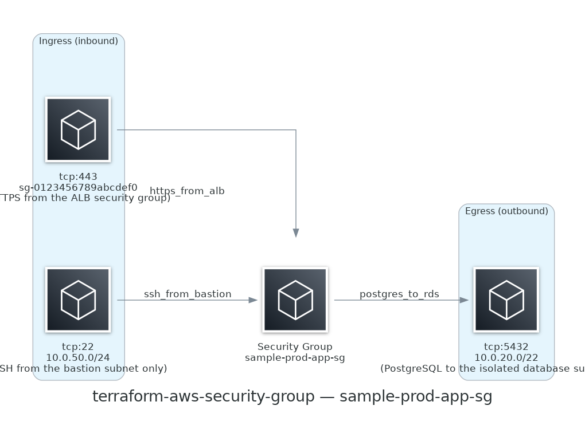

# terraform-aws-security-group

Reusable AWS security group module — explicit ingress/egress rules using
the modern split-resource model, least-privilege by default, with an
auditable opt-in for unrestricted egress.

Part of the [Devotica Terraform module catalog](https://registry.terraform.io/modules/devotica-labs).

[](https://github.com/devotica-labs/terraform-aws-security-group/actions/workflows/ci.yml)
[](https://github.com/devotica-labs/terraform-aws-security-group/actions/workflows/architecture-diagram.yml)
[](LICENSE)

## Architecture

<!-- BEGIN_ARCH -->



<sub>Generated by `.github/workflows/architecture-diagram.yml` on every push to main. Do not edit the image by hand — change the Terraform code in `examples/complete/` and the bot will regenerate it.</sub>

<!-- END_ARCH -->

## Security defaults

| Control | Default | Why |
|---|---|---|
| Ingress rules | None — empty map | True deny-all-inbound until you explicitly add rules. AWS adds no implicit inbound rule, so this default has no caveats. |
| Egress rules | None — empty map | No Terraform-managed egress rules by default. **Caveat:** AWS's `CreateSecurityGroup` API still attaches its own implicit allow-all-outbound rule regardless of this setting — see the comment above `aws_vpc_security_group_egress_rule.allow_all` in `main.tf`. |
| `create_default_egress_rule` | `false` | Wide-open egress requires explicit, auditable opt-in rather than being silent or implicit. |
| Rule shape validation | Enforced at plan time | Each rule must set exactly one of `cidr_ipv4` / `cidr_ipv6` / `referenced_security_group_id` / `prefix_list_id` — matches the AWS API's own constraint, caught before `apply` instead of as a runtime error. |

<!-- BEGIN_TF_DOCS -->


## Usage

### Basic

```hcl
# ---------------------------------------------------------------------------
# Provider block — CI-friendly skip flags + non-AWS-shaped placeholder creds.
#
# The skip_* flags let `terraform plan` run without calling STS
# GetCallerIdentity / EC2 IMDS. The access_key / secret_key values are
# intentionally NOT AWS-shaped (no AKIA / ASIA prefix, no 40-char base64)
# so gitleaks does not flag them as a leaked AWS access key — they exist
# only to satisfy the provider credential chain.
#
# In a real deployment, drop the skip_* flags AND the placeholder creds,
# and rely on your normal credential chain (OIDC role, profile,
# assume-role, etc.).
# ---------------------------------------------------------------------------
provider "aws" {
  region                      = "ap-south-1"
  access_key                  = "not-a-real-aws-key"
  secret_key                  = "not-a-real-aws-secret"
  skip_credentials_validation = true
  skip_metadata_api_check     = true
  skip_requesting_account_id  = true
}

module "security_group" {
  source = "../.."

  name        = "my-app-sg"
  description = "Allows inbound HTTPS from the internet"
  vpc_id      = "vpc-0123456789abcdef0"

  ingress_rules = {
    https = {
      description = "HTTPS from anywhere"
      from_port   = 443
      to_port     = 443
      ip_protocol = "tcp"
      cidr_ipv4   = "0.0.0.0/0"
    }
  }

  tags = {
    Environment = "example"
    Project     = "terraform-aws-security-group"
    Owner       = "platform@devotica.com"
    CostCenter  = "PLATFORM-OSS"
    ManagedBy   = "Terraform"
    Repo        = "https://github.com/devotica-labs/terraform-aws-security-group"
  }
}
```

### Complete

```hcl
# ---------------------------------------------------------------------------
# Provider block — CI-friendly skip flags + non-AWS-shaped placeholder creds.
#
# The skip_* flags let `terraform plan` run without calling STS
# GetCallerIdentity / EC2 IMDS. The access_key / secret_key values are
# intentionally NOT AWS-shaped (no AKIA / ASIA prefix, no 40-char base64)
# so gitleaks does not flag them as a leaked AWS access key — they exist
# only to satisfy the provider credential chain.
#
# In a real deployment, drop the skip_* flags AND the placeholder creds,
# and rely on your normal credential chain (OIDC role, profile,
# assume-role, etc.).
# ---------------------------------------------------------------------------
provider "aws" {
  region                      = "ap-south-1"
  access_key                  = "not-a-real-aws-key"
  secret_key                  = "not-a-real-aws-secret"
  skip_credentials_validation = true
  skip_metadata_api_check     = true
  skip_requesting_account_id  = true
}

module "security_group" {
  source = "../.."

  name        = "sample-prod-app-sg"
  description = "Application tier security group — HTTPS from ALB, egress to RDS and the internet for package updates"
  vpc_id      = "vpc-0123456789abcdef0"

  ingress_rules = {
    https_from_alb = {
      description                  = "HTTPS from the ALB security group"
      from_port                    = 443
      to_port                      = 443
      ip_protocol                  = "tcp"
      referenced_security_group_id = "sg-0123456789abcdef0"
    }
    ssh_from_bastion = {
      description = "SSH from the bastion subnet only"
      from_port   = 22
      to_port     = 22
      ip_protocol = "tcp"
      cidr_ipv4   = "10.0.50.0/24"
    }
  }

  egress_rules = {
    postgres_to_rds = {
      description = "PostgreSQL to the isolated database subnet tier"
      from_port   = 5432
      to_port     = 5432
      ip_protocol = "tcp"
      cidr_ipv4   = "10.0.20.0/22"
    }
  }

  # Deliberately false — this example shows least-privilege egress instead
  # of opting into the broad allow-all rule. Set to true only when you
  # genuinely need unrestricted outbound and have reviewed the AWS API
  # caveat documented above aws_vpc_security_group_egress_rule.allow_all
  # in main.tf.
  create_default_egress_rule = false

  tags = {
    Environment = "production"
    Project     = "sample"
    Owner       = "cloud-team@example.com"
    CostCenter  = "platform"
    ManagedBy   = "Terraform"
    Repo        = "https://github.com/devotica-labs/terraform-aws-security-group"
  }
}
```

## Requirements

| Name | Version |
|------|---------|
| <a name="requirement_terraform"></a> [terraform](#requirement\_terraform) | >= 1.6.0, < 2.0.0 |
| <a name="requirement_aws"></a> [aws](#requirement\_aws) | ~> 6.44 |
## Providers

| Name | Version |
|------|---------|
| <a name="provider_aws"></a> [aws](#provider\_aws) | ~> 6.44 |
## Resources

| Name | Type |
|------|------|
| [aws_security_group.this](https://registry.terraform.io/providers/hashicorp/aws/latest/docs/resources/security_group) | resource |
| [aws_vpc_security_group_egress_rule.allow_all](https://registry.terraform.io/providers/hashicorp/aws/latest/docs/resources/vpc_security_group_egress_rule) | resource |
| [aws_vpc_security_group_egress_rule.this](https://registry.terraform.io/providers/hashicorp/aws/latest/docs/resources/vpc_security_group_egress_rule) | resource |
| [aws_vpc_security_group_ingress_rule.this](https://registry.terraform.io/providers/hashicorp/aws/latest/docs/resources/vpc_security_group_ingress_rule) | resource |
## Inputs

| Name | Description | Type | Default | Required |
|------|-------------|------|---------|:--------:|
| <a name="input_name"></a> [name](#input\_name) | Name for the security group. Used directly as the SG name and as a prefix for rule Name tags. | `string` | n/a | yes |
| <a name="input_vpc_id"></a> [vpc\_id](#input\_vpc\_id) | ID of the VPC the security group belongs to. | `string` | n/a | yes |
| <a name="input_create_default_egress_rule"></a> [create\_default\_egress\_rule](#input\_create\_default\_egress\_rule) | Explicitly create one 'allow all IPv4 outbound' rule (0.0.0.0/0, all protocols). False by default — least privilege. See the comment above aws\_vpc\_security\_group\_egress\_rule.allow\_all in main.tf for an important AWS API caveat: setting this to false does NOT guarantee the security group has zero egress, because AWS's CreateSecurityGroup API auto-creates this exact rule regardless of what Terraform manages. This variable only controls whether Terraform also models/claims that rule explicitly. | `bool` | `false` | no |
| <a name="input_description"></a> [description](#input\_description) | Description for the security group. | `string` | `"Managed by Terraform (devotica-labs/security-group/aws)"` | no |
| <a name="input_egress_rules"></a> [egress\_rules](#input\_egress\_rules) | Map of outbound rules, keyed by your own descriptive rule name. Same shape and exactly-one-target constraint as ingress\_rules. Empty by default — see create\_default\_egress\_rule for the common 'allow all outbound' case. | <pre>map(object({<br/>    description                  = optional(string)<br/>    from_port                    = number<br/>    to_port                      = number<br/>    ip_protocol                  = string<br/>    cidr_ipv4                    = optional(string)<br/>    cidr_ipv6                    = optional(string)<br/>    referenced_security_group_id = optional(string)<br/>    prefix_list_id               = optional(string)<br/>  }))</pre> | `{}` | no |
| <a name="input_ingress_rules"></a> [ingress\_rules](#input\_ingress\_rules) | Map of inbound rules, keyed by your own descriptive rule name. Each entry must set exactly one of cidr\_ipv4 / cidr\_ipv6 / referenced\_security\_group\_id / prefix\_list\_id. Empty by default — no inbound traffic is allowed until you add rules. | <pre>map(object({<br/>    description                  = optional(string)<br/>    from_port                    = number<br/>    to_port                      = number<br/>    ip_protocol                  = string<br/>    cidr_ipv4                    = optional(string)<br/>    cidr_ipv6                    = optional(string)<br/>    referenced_security_group_id = optional(string)<br/>    prefix_list_id               = optional(string)<br/>  }))</pre> | `{}` | no |
| <a name="input_tags"></a> [tags](#input\_tags) | Extra tags merged onto every resource this module creates. | `map(string)` | `{}` | no |
## Outputs

| Name | Description |
|------|-------------|
| <a name="output_allow_all_egress_rule_id"></a> [allow\_all\_egress\_rule\_id](#output\_allow\_all\_egress\_rule\_id) | AWS security group rule ID of the explicit allow-all egress rule. Empty string when create\_default\_egress\_rule = false. |
| <a name="output_egress_rule_ids"></a> [egress\_rule\_ids](#output\_egress\_rule\_ids) | Map of rule key (from var.egress\_rules) to the AWS security group rule ID. |
| <a name="output_ingress_rule_ids"></a> [ingress\_rule\_ids](#output\_ingress\_rule\_ids) | Map of rule key (from var.ingress\_rules) to the AWS security group rule ID. |
| <a name="output_security_group_arn"></a> [security\_group\_arn](#output\_security\_group\_arn) | ARN of the security group. |
| <a name="output_security_group_id"></a> [security\_group\_id](#output\_security\_group\_id) | ID of the security group. |
| <a name="output_security_group_name"></a> [security\_group\_name](#output\_security\_group\_name) | Name of the security group. |
<!-- END_TF_DOCS -->

## Acknowledgements

Governance stack:

- CI: [`devotica-labs/terraform-shared-config`](https://github.com/devotica-labs/terraform-shared-config)
- Policy: [`devotica-labs/terraform-policies`](https://github.com/devotica-labs/terraform-policies)
- Bootstrap: [`devotica-labs/terraform-bootstrap-template`](https://github.com/devotica-labs/terraform-bootstrap-template)

## License

Apache-2.0 — see [LICENSE](LICENSE).
